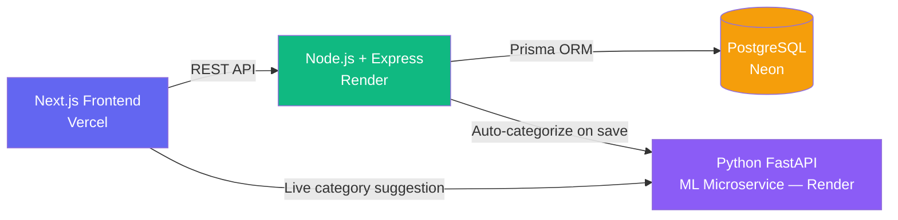

# 💰 SpendSmart — AI-Powered Expense Tracker

A full-stack expense tracking application that uses a machine learning microservice to automatically categorize expenses, tracks monthly budgets in real time, and visualizes spending patterns.

**🔗 Live Demo:** [expense-tracker-sigma-five-57.vercel.app](https://expense-tracker-sigma-five-57.vercel.app/)
**📦 Repository:** [github.com/Tornado780/expense-tracker](https://github.com/Tornado780/expense-tracker)

> **Note:** The backend and ML service are hosted on Render's free tier, which spins down after 15 minutes of inactivity. The first request may take 30-60 seconds to wake the services up — please be patient on first load.

**Demo login:** `demo@example.com` / `demo1234`

---

## 🖼️ Screenshots

| Dashboard | Expenses |
|---|---|
|  |  |


---

## ✨ Features

- 🤖 **AI Auto-Categorization** — A Naive Bayes classifier predicts the expense category in real time as you type, with a confidence score
- 📊 **Spending Dashboard** — Category breakdown (pie chart) and daily spending trend (line chart) using Recharts
- 💸 **Budget Management** — Set monthly limits per category with live progress bars
- 🔔 **Smart Alerts** — Automatic notifications at 80% and 100% of budget usage
- 📥 **CSV Export** — Download all expense data for personal records
- 🔐 **JWT Authentication** — Secure registration/login with bcrypt password hashing
- 🌍 **Multi-currency support** — Each user selects their preferred currency at signup
- 📱 **Fully responsive** — Works cleanly on mobile, tablet, and desktop

---

## 🏗️ Architecture

This project is built as **three independently deployed services**, each with a single responsibility:



**Why a separate ML microservice instead of embedding it in Node?**
Keeping the ML model in its own Python service means the Node API stays fast and dependency-light, the model can be retrained/redeployed independently, and if the ML service goes down, expense creation still works — it just falls back to category `"Other"` instead of crashing the request.

---

## 🛠️ Tech Stack

| Layer | Technology |
|---|---|
| Frontend | Next.js 14 (App Router), React, Tailwind CSS, Recharts, Axios |
| Backend API | Node.js, Express, Prisma ORM, JWT, bcrypt, Zod |
| ML Service | Python, FastAPI, scikit-learn (Naive Bayes), TF-IDF |
| Database | PostgreSQL (hosted on Neon, serverless) |
| Deployment | Vercel (frontend), Render (API + ML service) |

---

## 📂 Project Structure

```
expense-tracker/
├── backend/                 # Node.js REST API
│   ├── prisma/
│   │   ├── schema.prisma    # User, Expense, Budget, Alert models
│   │   └── seed.js
│   └── src/
│       ├── controllers/     # auth, expense, budget, alert
│       ├── routes/
│       ├── middleware/      # JWT auth
│       └── index.js
├── ml-service/               # Python ML microservice
│   ├── main.py               # FastAPI app + Naive Bayes classifier
│   └── requirements.txt
├── frontend/                 # Next.js application
│   ├── app/                  # pages (dashboard, expenses, budgets, profile)
│   ├── components/           # ExpenseForm, BudgetCard, AlertBell, charts...
│   └── context/AuthContext.js
└── render.yaml                # Render deployment blueprint
```

---

## 🔌 API Endpoints

### Auth
| Method | Endpoint | Description |
|---|---|---|
| POST | `/api/auth/register` | Create a new account |
| POST | `/api/auth/login` | Log in, returns JWT |
| GET | `/api/auth/me` | Get current user |
| PATCH | `/api/auth/me` | Update name / currency |

### Expenses
| Method | Endpoint | Description |
|---|---|---|
| GET | `/api/expenses` | List expenses (filter by category/date, paginated) |
| GET | `/api/expenses/summary` | Monthly totals by category |
| GET | `/api/expenses/export` | Download CSV |
| POST | `/api/expenses` | Create expense (auto-categorized via ML if no category given) |
| PATCH | `/api/expenses/:id` | Update an expense |
| DELETE | `/api/expenses/:id` | Delete an expense |

### Budgets & Alerts
| Method | Endpoint | Description |
|---|---|---|
| GET | `/api/budgets` | List budgets for a month with spend progress |
| POST | `/api/budgets` | Create a budget |
| PATCH | `/api/budgets/:id` | Update budget limit |
| DELETE | `/api/budgets/:id` | Delete a budget |
| GET | `/api/alerts` | List alerts |
| PATCH | `/api/alerts/:id/read` | Mark alert as read |

### ML Service
| Method | Endpoint | Description |
|---|---|---|
| POST | `/categorize` | Takes `{description}`, returns `{category, confidence}` |

---

## 🚀 Local Setup

### Prerequisites
- Node.js 18+
- Python 3.9+
- A PostgreSQL database (e.g. free [Neon](https://neon.tech) instance)

### 1. Clone and install
```bash
git clone https://github.com/Tornado780/expense-tracker.git
cd expense-tracker
```

### 2. Backend
```bash
cd backend
cp .env.example .env
# Fill in DATABASE_URL (Neon), JWT_SECRET, ML_SERVICE_URL=http://localhost:8000
npm install
npx prisma db push
npx prisma generate
node prisma/seed.js   # optional demo data
npm run dev            # runs on :3000
```

### 3. ML Service
```bash
cd ../ml-service
pip install -r requirements.txt
python -m uvicorn main:app --reload --port 8000
```

### 4. Frontend
```bash
cd ../frontend
npm install
# Create .env.local:
# NEXT_PUBLIC_API_URL=http://localhost:3000/api
# NEXT_PUBLIC_ML_URL=http://localhost:8000
npm run dev -- --port 3001
```

Visit `http://localhost:3001` and log in with `demo@example.com` / `demo1234`.

---

## 🧠 How the ML categorization works

The model is a **Naive Bayes classifier** trained on ~150 labeled expense descriptions (e.g. *"swiggy dinner"* → Food & Dining, *"uber ride"* → Transport) using TF-IDF vectorization with unigrams + bigrams. When a user types a description, the frontend debounces the input and calls the ML service directly for a live prediction — shown as a confidence badge before the expense is even saved. If confidence is below 60%, the UI flags it for manual confirmation rather than silently guessing wrong.

---

## 📄 License

MIT — free to use as a reference or starting point for your own project.

---

## 👤 Author

**Rahul Garg**
[GitHub](https://github.com/Tornado780) · [LinkedIn](https://www.linkedin.com/in/rahul-garg-8230062bb/)